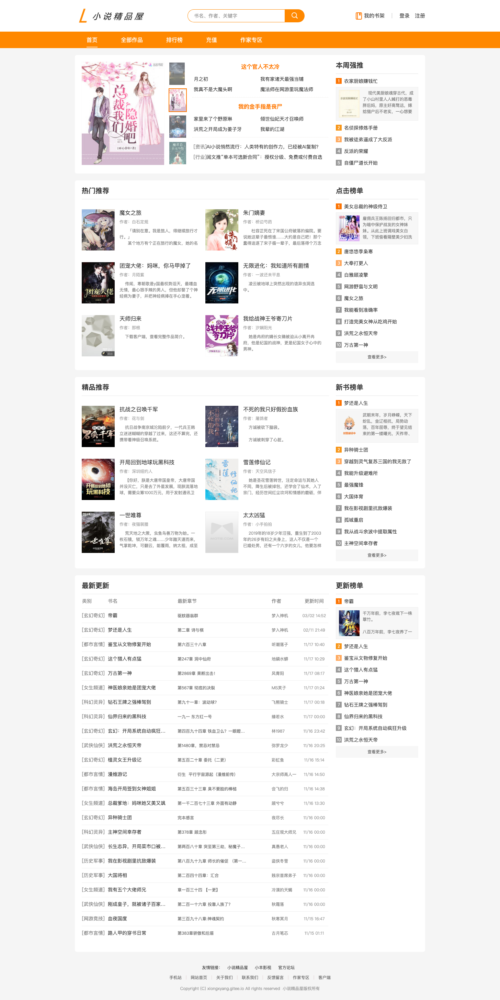

# Novel Cloud

## 项目模块

### 门户首页

首页包括 `小说推荐（包括轮播图、周推、强推等）`、`新闻公告`、`点击榜`、`新书榜`、`更新榜（包括最新更新列表）` 和 `友情链接` 6个内容区域的展示

`首页是我们小说门户的入口，承载着我们系统很大一部分流量，并且内容不需要实时更新。所以首页相关内容的查询最好都做缓存处理。`

### 新闻中心

### 用户中心

### 小说

### 支付

### 作家

### 文件

### 搜索

##### 缓存数据一致性问题

###### 双写模式（最终一致性）

数据库->更新->缓存

> 缓存暂时脏数据，缓存过期后自动更新

###### 失效模式（实时一致性）

写数据库->删除缓存->写缓存

#### 分布式Session

##### 什么是Session

Session是一种服务器端的机制，用来存储客户端的状态信息，客户端每次请求都会带上SessionId，服务器根据SessionId来判断客户端的合法性

##### Session的作用

1. 服务端保存客户端的状态信息，可以实现客户端的登录状态
2. Session可以设置过期时间，过期后需要重新登录
3. Session可以设置权限，只有拥有权限的Session才能访问某些资源
4. Session可以设置刷新时间，过了刷新时间就需要重新登录
5. Session可以设置跨域访问
6. Session可以设置集群
7. Session可以设置分布式
8. Session可以设置共享
9. Session可以设置持久化
